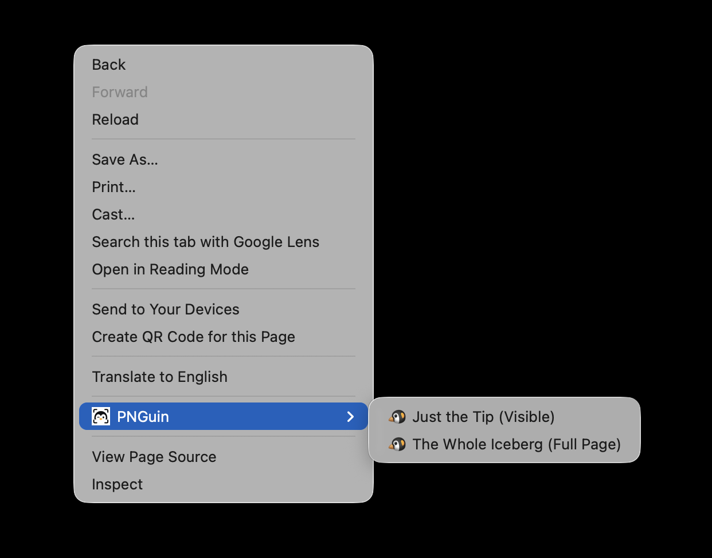

# PNGuin

Right-click any page to capture a screenshot. Downloads instantly as a PNG.

## Features

- **Just the Tip** — captures exactly what's visible in the viewport
- **The Whole Iceberg** — captures the full scrollable page in one shot
- No signup, no settings, no toolbar clutter
- Files land in your Downloads folder, timestamped and named

## Install

### Chrome Web Store
Coming soon.

### Load from source
1. Clone this repo
2. Go to `chrome://extensions`
3. Enable **Developer mode**
4. Click **Load unpacked** and select the repo folder

## Usage

Right-click anywhere on a page → **PNGuin** → pick your shot.

## Permissions

| Permission | Why |
|---|---|
| `activeTab` | Capture the current tab |
| `contextMenus` | Add items to the right-click menu |
| `debugger` | Measure full page dimensions for full-page capture |
| `downloads` | Save the PNG to your Downloads folder |

## Privacy

PNGuin collects no data. Everything happens locally. See [pnguin.dev/privacy.html](https://pnguin.dev/privacy.html).

## License

MIT
